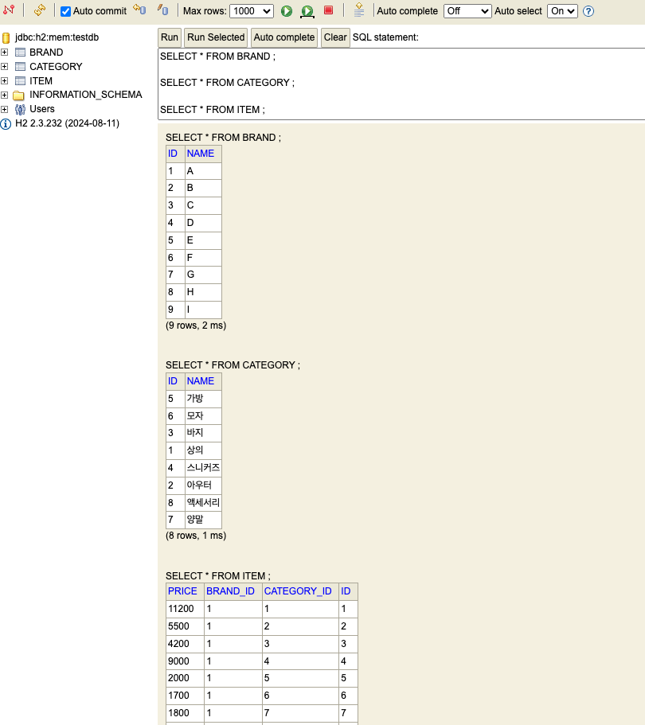
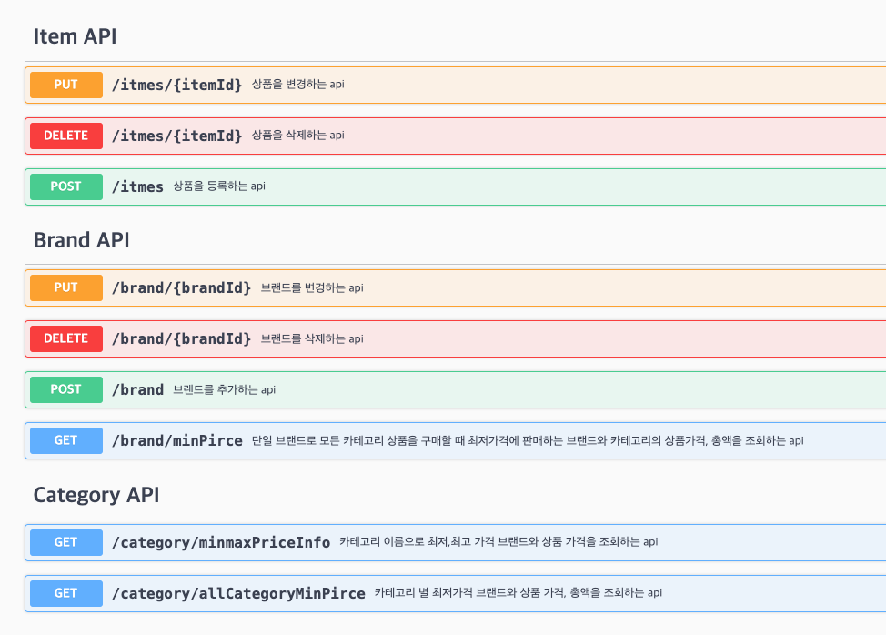

# 무신사 상품관리 API

## 구현범위

* 요구사항 4가지를 만족하는 무신사 상품관리 API를 개발
  * 고객은 카테고리 별로 최저가격인 브랜드와 가격을 조회하고 총액이 얼마인지 확인할 수 있어야 합니다.
  * 고객은 단일 브랜드로 전체 카테고리 상품을 구매할 경우 최저가격인 브랜드와 총액이 얼마인지 확인할 수 있어야 합니다.
  * 고객은 특정 카테고리에서 최저가격 브랜드와 최고가격 브랜드를 확인하고 각 브랜드 상품의 가격을 확인할 수 있어야 합니다.
  * 운영자는 새로운 브랜드를 등록하고, 모든 브랜드의 상품을 추가, 변경, 삭제할 수 있어야 합니다.
    <br/>
    <br/>
* 카테고리
  * 추가, 수정, 삭제가 불가능합니다.
    <br/>
    <br/>
* 브랜드
  * 추가 : 존재하는 모든 카테고리(8개)에 해당하는 상품을 함께 추가해야합니다. (브랜드의 카테고리에는 1개의 상품은 존재 조건 때문)
  * 수정 : '이름'만 수정할 수 있습니다. 브랜드에 해당하는 상품을 수정하기 위해서는 상품 API를 사용해야 합니다.
  * 삭제 : 해당 브랜드의 모든 상품도 함께 삭제됩니다.
    <br/>
    <br/>
* 상품
  * 추가 : 브랜드와 카테고리를 선택하여 상품을 추가할 수 있습니다.
  * 수정 : 가격, 카테고리를 수정할 수 있습니다. 카테고리를 변경할 때, 기존 카테고리에 해당하는 상품은 1개이상 존재해야합니다. (브랜드의 카테고리에는 1개의 상품은 존재 조건 때문)
  * 삭제 : 해당 상품을 삭제합니다. 삭제시 기존 카테고리에 해당하는 상품은 1개이상 존재해야합니다. (브랜드의 카테고리에는 1개의 상품은 존재 조건 때문)

<br/>

## 코드 빌드, 테스트, 실행 방법
```bash
./gradlew build
./gradlew bootRun
./gradlew test
```


## 개발 스펙
* Java 17
* Spring Boot
* Gradle
* Swagger
  * 접속정보 : (url) http://localhost:8080/swagger-ui/index.html#/
* Embedded H2
    * 접속정보 : (url) http://localhost:8080/h2-console

  

##  DataBase (실행시 준비된 데이터 생성됨)


##  SWAGGER API


## 요구사항1
#### 고객은 카테고리 별로 최저가격인 브랜드와 가격을 조회하고 총액이 얼마인지 확인할 수 있어야 합니다.
```bash
http://localhost:8080/swagger-ui/index.html#/Category%20API/getMinPriceBrandAndTotalByCategory
```

## 요구사항2
#### 고객은 단일 브랜드로 전체 카테고리 상품을 구매할 경우 최저가격인 브랜드와 총액이 얼마인지 확인할 수 있어야 합니다.
```bash
http://localhost:8080/swagger-ui/index.html#/Brand%20API/getMinPriceBrandForAllCategories
```

## 요구사항3
#### 고객은 특정 카테고리에서 최저가격 브랜드와 최고가격 브랜드를 확인하고 각 브랜드 상품의 가격을 확인할 수 있어야 합니다.
```bash
http://localhost:8080/swagger-ui/index.html#/Category%20API/getMinMaxBrandAndPriceByCategory
```

## 요구사항4
#### 고객은 카테고리 별로 최저가격인 브랜드와 가격을 조회하고 총액이 얼마인지 확인할 수 있어야 합니다.
```bash
Swagger에서 위의 3개 API를 제외한 나머지 API
```


